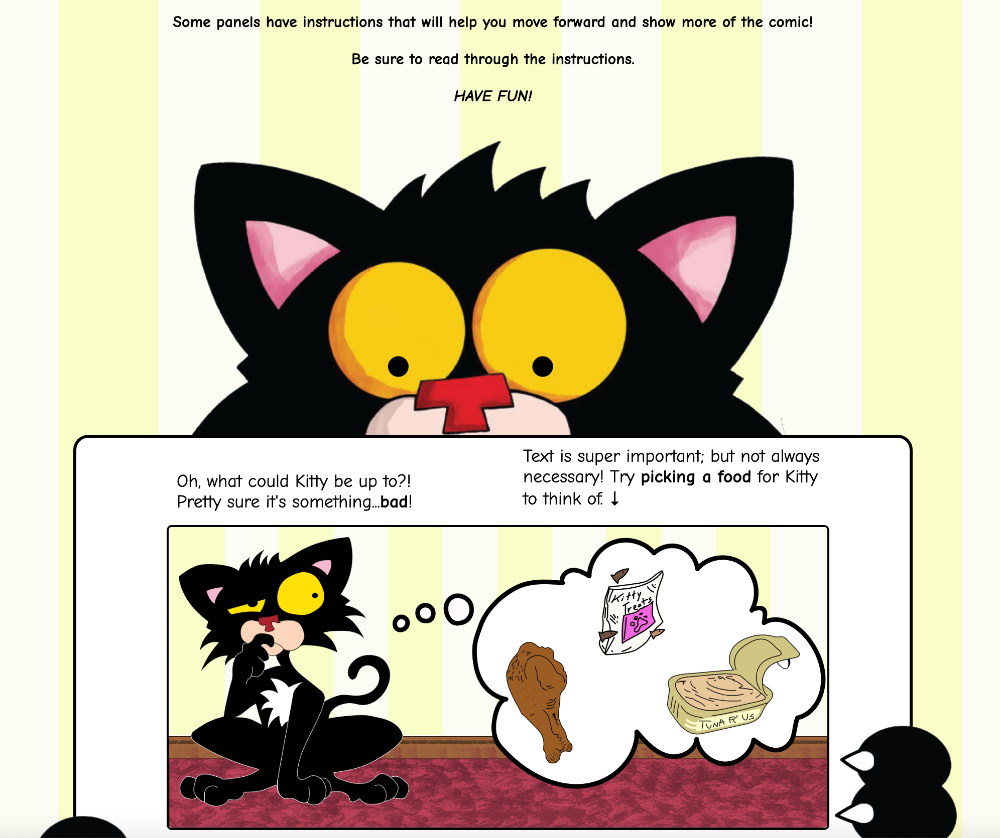

# Bad-Kitty-Project

## Description

- A **full-stack** browser game designed to enrich the visitor experience at the Bad Kitty exhibition, hosted by the **Longwood Center for the Visual Arts** in October 2024 as part of the **Virginia Children's Book Festival**. The game is based on the book series **"Bad Kitty"** by Nick Bruel. This game was made with their permission.

The game logic, story, concept, and art are created by Bobby "Sun" English Jr.

### Services/Stack

**Frontend**: 

- Vanilla JavaScript: For direct DOM manipulation to handle user interactions and updates to the game interface (e.g., rendering selections, handling canvas drawings).
- HTML5 Canvas: Used for allowing users to draw on the second page of the comic.
- CSS: For styling the game interface.
- Netlify hosting
  
**Backend**:

- Node.js
- Render hosting

**Storage**: 

- **Amazon Web Services/AWS** was used as image storage for QR code integration.

### Game Features

- **Responsive Design**: The application is fully responsive, providing an optimized experience across devices (tablet, desktop, and large mobile devices(landscaped Iphone Pros, etc.)).
- **Dynamic Storytelling**: The game adapts based on user choices, creating a unique storyline for each player.
- **Save**: Users can save their comic pages (using AWS)
  
### User Instructions:
-**How to Play**: 

- Choose options on the first page to shape the story.
- Draw on the canvas on the second page to illustrate story.
- Save the comic as images using the QR code feature.

### Planned Features

- **Social Media Integration**: Allow users to share comics on social platforms.
- **REACT/JSX/Redux**: Switch code to utilize React and Redux
- **REACT Library**: Create library for components to make easier comic creation in the future

### Updates

- **Release version 1.0**: Game Released Oct 16th, 2024 in conjunction with Virginia Children's Book Festival
- **Patch version 1.1**: Based on witnessing the game being played by multiple people. Completely overhauled UX so that game flow follows the natural path of the story. Much easier to play and follow. Released Oct 17th, 2024
